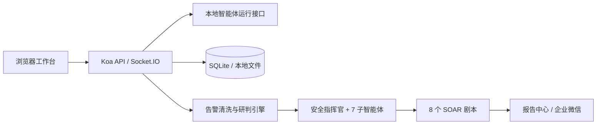

# 基于多智能体协同的全链路网络威胁一体化防护平台

面向安全运营与授权安全验证场景的一体化多智能体平台。系统将任务对话、授权红队验证、告警清洗降噪、并行智能研判、处置建议和事件报告汇聚到同一个本地工作台中，支持真实数据导入、过程留痕与结果复核。

> 安全声明：红队能力仅用于已取得明确授权的资产与安全测试任务。请勿将本项目用于未授权探测、攻击或其他违法活动。

## 项目亮点

- **红蓝协同**：授权红队任务产生的攻击链证据，可与蓝队告警研判和事件报告在同一平台查看。
- **告警降噪**：接收 CSV、JSON、Excel 告警数据，完成字段映射、编码兼容、数据校验、指纹聚合和时间窗降噪。
- **多智能体研判**：由安全指挥官识别攻击画像并调度 7 个专业子智能体并行分析。
- **处置闭环**：根据研判结论从 8 个 SOAR 剧本中生成处置建议，高风险动作保留人工审批边界。
- **过程可追溯**：任务对话、思考过程、工具调用、攻击链、历史批次和事件报告均可持久化查看。
- **本地优先**：前后端、SQLite 状态存储和智能体运行接口可以在单机完成，不依赖 Kubernetes、外部数据库或消息队列。

## 已实现功能

### 1. 授权红队安全验证

- 在任务中心创建授权安全验证任务并选择模型。
- 记录目标、范围、授权边界和执行过程。
- 流式展示智能体分析、工具调用与阶段结果。
- 将多轮执行信息汇总为攻击链，而不是只展示最后一条消息。
- 任务运行与页面解耦，切换到其他模块后任务继续执行。
- 支持将脱敏后的安全评估报告纳入报告中心。

红队任务必须包含授权确认标识：

```text
AUTHORIZED_SECURITY_VALIDATION
```

### 2. 告警降噪智能研判

- 导入 CSV、JSON、XLSX 等多源告警。
- 将常见中英文字段别名映射为 **25 个标准字段**。
- 自动处理 UTF-8、GB18030 等编码差异并校验必填字段。
- 按来源、目标、端口、账号、告警类型和规则形成事件指纹。
- 在 10 分钟时间窗内归并重复告警，输出降噪率和安全事件批次。
- 安全指挥官按攻击画像调度 **7 个子智能体**并行研判。
- 根据结论匹配 **8 个 SOAR 剧本**，区分自动执行建议与人工审批动作。
- 研判结果写入历史批次，可再次预览、复核和生成简报。
- 支持向企业微信机器人发送脱敏后的简短报告。

告警导入模板位于：

```text
tests/fixtures/alert-triage-upload.csv
```

核心必填字段为：

```text
alert_id, source_ip, destination_ip, alert_type, severity
```

### 3. 智能体与任务中心

- 统一展示安全任务和历史问答。
- 支持新建任务、模型选择、运行状态和结果持久化。
- 支持智能体新建、编辑、节点拖拽、连线和工作流保存。
- 支持任务执行快照、节点证据和运行历史回放。
- 对话使用 Socket.IO 流式传输，并隔离不同任务的并发状态。

### 4. 报告中心

- 将攻击过程、关键发现、风险评级、证据链和修复建议结构化展示。
- 支持历史报告预览和脱敏报告归档。
- 已内置一份脱敏安全评估报告作为报告展示样例。
- 对企业微信外发内容隐藏完整 IP、原始日志和敏感命令行。

## 轻量化架构



轻量化并不意味着删减关键能力，而是减少部署依赖：

| 项目 | 默认方式 |
| --- | --- |
| 前端 | Vue 3 + Vite，单页面应用 |
| 后端 | Koa + Socket.IO，单 Node.js 进程 |
| 状态存储 | SQLite 与本地文件，无需独立数据库 |
| 智能体运行 | 本地运行接口，可配置不同模型提供方 |
| 部署方式 | 本地一键启动或单容器 Docker Compose |
| 默认开发端口 | 前端 `8659`，后端 `8657` |
| 默认容器端口 | `6060` |

## 一键启动（推荐）

### 环境要求

- macOS、Linux 或 WSL
- Node.js 22.12 及以上，推荐 Node.js 24
- npm 10 及以上

### 本地轻量模式

```bash
git clone https://github.com/dongper/multi-agent-cyber-defense-platform.git
cd multi-agent-cyber-defense-platform
npm run deploy:local
```

脚本会检查 Node.js 版本；首次运行时安装依赖，随后同时启动前端和后端。

访问地址：

```text
http://127.0.0.1:8659/#/security-operations
```

再次启动时不会重复安装已有依赖。停止服务请在启动终端中按 `Control + C`。

### 直接使用开发命令

依赖已经安装时，可以直接执行：

```bash
npm run dev:security
```

该命令是安全平台的语义化入口，内部兼容现有启动流程。

## Docker 一键部署

### 环境要求

- Docker Engine 或 Docker Desktop
- Docker Compose v2

运行：

```bash
git clone https://github.com/dongper/multi-agent-cyber-defense-platform.git
cd multi-agent-cyber-defense-platform
npm run deploy:docker
```

访问：

```text
http://127.0.0.1:6060
```

常用管理命令：

```bash
# 查看状态
docker compose ps

# 查看日志
docker compose logs -f cyber-defense-platform

# 停止服务（保留数据）
docker compose down

# 重新构建并启动
docker compose up -d --build
```

默认数据写入项目目录下的 `platform_data/`，删除容器不会删除该目录中的任务、配置和会话数据。

> Docker 首次运行需要拉取基础运行时并构建镜像，耗时和磁盘占用会高于本地模式；如果用于现场演示，建议提前完成构建并验证登录、模型和企业微信配置。

## 模型配置

启动后在模型配置页面添加可用模型提供方，并完成认证或 API Key 配置。任务中心的模型选择器只展示当前账号有权使用的模型。

建议在演示前完成以下检查：

1. 模型认证状态正常。
2. 新建任务可以产生流式回复。
3. 页面切换后回复不中断。
4. 告警模板可以成功导入。
5. 企业微信机器人地址可以保存并验证连接。

请勿把 API Key、访问令牌或企业微信机器人完整地址提交到 Git 仓库。

## 企业微信机器人

在“告警降噪研判 → 企业微信推送配置”中填写机器人 Webhook。地址只保存于当前运行环境，不应写入项目源码。

平台只接受企业微信官方机器人地址：

```text
https://qyapi.weixin.qq.com/cgi-bin/webhook/send?key=...
```

推送内容为脱敏后的研判摘要，包括批次、风险级别、事件数量、核心结论和处置建议。

## 验证项目

运行安全场景专项测试：

```bash
npm exec vitest run \
  tests/client/alert-triage.test.ts \
  tests/client/cyber-defense-merged.test.ts \
  tests/server/cyber-defense-wechat-report.test.ts
```

当前专项验证基线：

```text
Test Files  3 passed
Tests      16 passed
```

完整工程验证：

```bash
npm run harness:check
npm run test
npm run build
```

## 目录结构

```text
packages/
├── client/       Vue 3 前端、任务中心、告警研判、报告和工作流
├── server/       Koa API、Socket.IO、SQLite、智能体运行与推送服务
└── desktop/      Electron 桌面封装与本地运行时

tests/
├── client/       前端与业务逻辑测试
├── server/       服务端与安全边界测试
└── e2e/          Playwright 交互流程测试

scripts/          构建、验证和一键部署脚本
.github/workflows 自动测试、构建和发布流程
```

## 技术栈

Vue 3 · TypeScript · Vite · Pinia · Naive UI · Vue Flow · Koa · Socket.IO · SQLite · Vitest · Playwright · Electron · Docker

## 兼容性说明

本项目在既有本地智能体运行框架之上完成安全场景集成。为了兼容已有配置、数据目录、API 路径和第三方运行时，部分内部目录、代码命名与环境变量仍保留 `hermes` 前缀，例如 `HERMES_WEB_UI_HOME`。这些名称属于底层兼容接口，不代表当前产品名称，也不建议在没有迁移方案的情况下直接批量重命名。

用户界面、部署说明和对外材料统一使用“多智能体网络威胁一体化防护平台”或“红蓝协同智能安全运营平台”。

## 安全与数据边界

- 红队验证必须记录授权范围，禁止用于未授权目标。
- 高风险 SOAR 动作默认要求人工审批。
- 报告外发前执行 IP、日志和命令行脱敏。
- 模型密钥与机器人 Webhook 不写入仓库。
- 历史会话与平台状态默认保存在本机。
- 生产接入前应根据企业要求补充账号权限、审计留存和密钥托管策略。

## License

本仓库延续所集成上游组件的 BSL-1.1 许可。使用、修改和分发前请阅读 [`LICENSE`](./LICENSE)，并分别遵守所调用模型、运行时及第三方依赖的许可证与服务条款。
